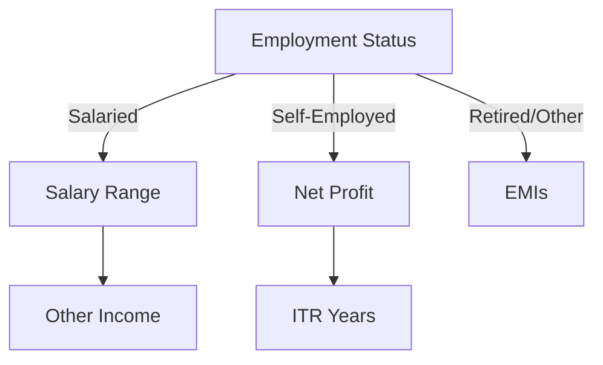

# Unbias Lending – Borrower Onboarding Form Flow Specification  
*(File: unbias-lending-form-flow-specification.md · v1.0 · 29 May 2025)*  

---

## 1. Purpose  
This document defines the complete **17-screen borrower onboarding wizard** for Unbias.money. It is written as a build-ready reference for **Factory.ai vibe-coding** and covers UI copy, data mapping, conditional logic, validation, progress tracking, and Supabase persistence.

---

## 2. Global UX Guidelines  

| Item | Spec |
|------|------|
| **Layout** | Mobile-first; 1 column form; Tailwind CSS classes. |
| **Component Core** | `FormStepLayout` (title, leading text, main control, Continue button). |
| **State** | Persist to React Context (`BorrowerDraftContext`) + localStorage autosave; commit to Supabase on OTP verification. |
| **Routing** | Next.js `/onboarding/[step]`; guard to force sequential order. |
| **Progress Bar** | `ProgressBar` component receives `currentIndex` (0-11) & static `steps` array. |
| **Validation** | Zod schema per step → integrated with `react-hook-form`. |
| **Accessibility** | Button text + aria-labels, keyboard navigation. |

---

## 3. Screen-by-Screen Breakdown  

| # | Route | Title / Leading Copy | Inputs | Validation | DB Field(s) |
|---|-------|----------------------|--------|------------|-------------|
| 1 | welcome | “Welcome to Unbias.money!” | Journey Stage selector (4 options) | required | `journey_stage` enum |
| 2 | property-type | “What kind of property are you interested in?” | Radio buttons (6) | required | `property_type` |
| 3 | property-value | “What’s the estimated value of the property?” | Price-range buttons | required | `property_value_range` (later converts to min/max numeric) |
| 4 | property-city | “In which city is the property located?” | Select common cities + “Other” text | required | `city` |
| 5 | property-pincode | “What’s the property’s Pincode?” | Text (optional, 6 digits) | regex if filled | `pincode` |
| 6 | loan-amount | “How much loan are you looking for (approx.)?” | Numeric input ₹ | required, ≥1 L | `loan_amount_required` |
| 7 | dob | “What’s your date of birth?” | Date picker | age 18-70 | `dob` |
| 8 | employment | “What’s your current employment status?” | Radio (5) | required | `employment_type` |
| 9a | salary-range (salaried) | “What’s your gross monthly salary?” | Range buttons | required | `gross_salary_range` |
| 10a | other-income (salaried) | “Other monthly income?” | Numeric ₹ | default 0 | `other_income` |
| 9b | net-profit (self-emp) | “Last reported annual net profit?” | Range buttons | required | `annual_net_profit_range` |
| 10b | itr-years (self-emp) | “Years filing ITRs?” | Radio 1-5+ | required | `itr_years` |
| 11 | emis | “Total monthly EMIs?” | Numeric ₹ | default 0 | `existing_emi` |
| 12 | coapp | “Will you be applying with a co-applicant?” | Yes/No | required | `has_coapplicant` (bool) |
| 13 | mobile | “Enter your mobile number” | Phone + T&C checkbox | phone regex + consent | `mobile`, `consent_ts` |
| 14 | otp | “Enter the OTP” | 6-digit OTP | match 2Factor API | verified flag |
| 15 | loading | “Finding the best loan offers…” | loading spinner | n/a | n/a |

**Skip Map**  
* If employment_type = Salaried → screens 9a & 10a.  
* If Self-Employed Professional or Business → screens 9b & 10b.  
* Retired / Other → skip to screen 11.

Total dynamic steps: salaried path = 15 screens, self-emp = 15, others = 13.  
Progress bar displays percentage based on path length.

---

## 4. Data → Supabase Mapping  

Table `borrower_drafts` (before OTP)  

| Column | Source Screen | Type |
|--------|---------------|------|
| journey_stage | 1 | text |
| property_type | 2 | text |
| property_value_est | 3 | numeric |
| city | 4 | text |
| pincode | 5 | text |
| loan_amount_required | 6 | numeric |
| dob | 7 | date |
| employment_type | 8 | text |
| gross_salary | 9a | numeric |
| other_income | 10a | numeric |
| annual_net_profit | 9b | numeric |
| itr_years | 10b | int |
| existing_emi | 11 | numeric |
| has_coapplicant | 12 | bool |
| mobile | 13 | text |
| consent_ts | 13 | timestamptz default now() |
| verified | 14 | bool default false |

After OTP success, row is **moved** to `borrowers` and gets an Auth UID.

---

## 5. Conditional Logic Diagram  



All paths merge at **EMIs → Co-Applicant → Mobile → OTP**.

---

## 6. Validation Rules Reference  

| Field | Rule |
|-------|------|
| mobile | `^[6-9]\d{9}$` (Indian) |
| pincode | `^\d{6}$` (if filled) |
| dob | between (today-70y) and (today-18y) |
| loan_amount_required | ≥ ₹100 000, whole number |
| existing_emi, other_income | ≥0, integer |
| price range / salary range buttons | maps to numeric min/max behind the scenes |

Centralised Zod schemas: `zodBorrowerStepSchemas.ts`.

---

## 7. State Management & Data Flow  

```
[FormStep] → updateDraft(field,value)  // context + localStorage
Finish OTP ✔ → mutation: supabase.rpc('finalize_draft', {draft_id})
supabase.auth.signInWithOtp(mobile)
```

TanStack Query handles:  
- mutation for `finalize_draft`  
- invalidating `offers` query after completion.

---

## 8. Component Reuse Matrix  

| Component | Reused In | Notes |
|-----------|-----------|-------|
| `RangeButtonGroup` | price, salary, profit | Accepts `options[]` prop |
| `NumericInput` | loan amount, EMIs, income | formatted with react-number-format |
| `RadioCardGroup` | journey, property type, employment | generic choices |
| `ProgressBar` | all steps ≥2 | calculates % based on path array length |
| `OtpInput` | OTP screen | 6 separate boxes |

---

## 9. Factory.ai Prompt Catalogue  

| Screen | Prompt |
|--------|--------|
| 1 | “Generate WelcomeStep component with four selectable JourneyStage cards, Tailwind styling.” |
| 2 | “Add PropertyTypeStep using RadioCardGroup with options list.” |
| 6 | “Implement LoanAmountStep with NumericInput and zod validation min 1_00_000.” |
| 8 | “Create EmploymentStep with enum values, updates context.” |
| 9a | “Create SalaryRangeStep: accepts salaryRanges array, maps to numeric band.” |
| 13 | “Build MobileVerifyStep: phone input, checkbox links, uses supabase.auth.signInWithOtp.” |
| 14 | “Generate OtpStep component using OtpInput, verify via Supabase verifyOtp.” |
| Layout | “Scaffold FormStepLayout that receives {title, leadText, children} and renders progress bar.” |

Each prompt should include file path (`/app/onboarding/SalaryRangeStep.tsx`), Zod import, and reference `BorrowerDraftContext`.

---

## 10. Progress Tracking Logic  

```
const BASE_STEPS = [
  'property-type','property-value','property-city','property-pincode',
  'loan-amount','dob','employment','salary-range|net-profit',
  'other-income|itr-years', 'emis','coapp','mobile','otp'
]
calculateProgress(currentStep){
  const total = pathDependentSteps.length
  const index = pathDependentSteps.indexOf(currentStep)
  return (index/total)*100
}
```

Path is derived once employment_type chosen.

---

## 11. Supabase RPC Helpers  

1. `finalize_draft(draft_id uuid)` – moves row to `borrowers`, returns new id.  
2. Trigger `after insert on borrowers` → call `match_offers`.  

---

## 12. Testing Checklist  

| Scenario | Tool |
|----------|------|
| Salaried happy path | Playwright mobile viewport |
| Self-Employed path | Playwright |
| OTP failure + resend | Vitest mocking 2Factor SDK |
| Skip optional fields | Unit tests for Zod optional validation |

---

## 13. Future Enhancements  

- **Address autofill API** for city + pincode.  
- **PAN & Aadhaar masked capture** post-offer stage.  
- **Save & resume** deep link via token emailed to user.  

---

_This specification is the single source of truth for generating the borrower onboarding experience with Factory.ai. All subsequent prompts and code should adhere to the field names, validation rules, and component contracts outlined above._